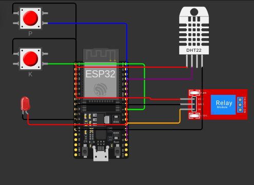

# FIAP - Faculdade de Informática e Administração Paulista

<p align="center">
<a href= "https://www.fiap.com.br/"></a>
</p>

<br>

## 🔗 Repositório

[https://github.com/kalilReis/farmtech-fase3-entrega1](https://github.com/kalilReis/farmtech-fase3-entrega1)

<br>

# Simulador de Sensores Agrícolas e Controle de Irrigação com ESP32 (Wokwi + PlatformIO)

## Kalil

## 👨‍🎓 Integrantes

- <a href="https://github.com/kalilReis">Kalil Reis de Sisto</a>

## 👩‍🏫 Professores

### Tutor(a)

- <a href="https://www.linkedin.com/company/inova-fusca">Leonardo Ruiz Orabona</a>

### Coordenador(a)

- <a href="https://www.linkedin.com/company/inova-fusca"> André Godoy acho</a>

## 📜 Descrição

Este projeto consiste em um sistema embarcado de simulação para monitoramento de sensores agrícolas e controle de irrigação, utilizando ESP32, PlatformIO e a plataforma Wokwi.

<p align="center">
  
</p>

O sistema simula:

- **Sensor de Fósforo (P):** botão físico (pressionado = presença, solto = ausência)
- **Sensor de Potássio (K):** botão físico (mesma lógica do fósforo)
- **Sensor de luminosidade (LDR):** sensor LDR (resistor dependente de luz, fornece valor analógico conforme a intensidade luminosa)
- **Sensor de umidade do solo:** DHT22 (valor analógico em tempo real)
- **Bomba de irrigação:** relé controlado pelo ESP32, com status indicado por LED

**Lógica de irrigação:** Para que a água seja liberada (LED aceso), é necessário que a umidade do solo esteja abaixo de 40% e que exista fósforo ou potássio detectado (ou seja, pelo menos um dos botões esteja pressionado).

O ESP32 lê os sensores e aciona o relé da bomba de irrigação conforme a lógica definida no código. O circuito é montado e simulado na plataforma Wokwi.com, utilizando componentes disponíveis para simulação. Toda a lógica de funcionamento está documentada neste README, incluindo imagem do circuito.

---

## ℹ️ Sobre o Sensor LDR

O **LDR (Light Dependent Resistor)**, ou fotoresistor, é um sensor que varia sua resistência elétrica conforme a intensidade da luz incidente. No contexto deste projeto, o LDR está conectado a uma entrada analógica do ESP32 e permite simular a leitura de luminosidade do ambiente.

- **Como funciona:** Quanto maior a intensidade de luz sobre o LDR, menor sua resistência e maior o valor lido pelo pino analógico do ESP32. Em ambientes escuros, a resistência aumenta e o valor lido diminui.
- **Aplicação no projeto:** O valor analógico do LDR pode ser utilizado para simular condições ambientais, como luminosidade do solo, e pode ser adaptado para representar outros parâmetros, caso necessário.

No circuito simulado, o LDR está ligado ao pino 34 do ESP32, conforme o diagrama apresentado.

## 📁 Estrutura de pastas

Dentre os arquivos e pastas presentes na raiz do projeto, definem-se:

- <b>assets</b>: arquivos relacionados a elementos não-estruturados deste repositório, como imagens.

- <b>document</b>: documentos do projeto que as atividades poderão pedir. Na subpasta "other", adicione documentos complementares e menos importantes.

- <b>src</b>: Todo o código-fonte criado para o desenvolvimento do projeto ao longo das fases, incluindo o arquivo principal <b>prog1.ino</b>.

- <b>README.md</b>: arquivo que serve como guia e explicação geral sobre o projeto (o mesmo que você está lendo agora).

## 🔧 Como executar o código

**Pré-requisitos:**

- PlatformIO instalado no VSCode ([guia de instalação](https://platformio.org/install))
- Extensão Wokwi para VSCode ([guia oficial](https://docs.wokwi.com/pt-BR/guides/vscode-extension))
- Placa de desenvolvimento compatível (ex: ESP32)

**Passos para execução:**

1.  **Clone o repositório:**

    ```bash
    git clone https://github.com/kalilReis/farmtech-fase3-entrega1
    cd farmtech-fase3-entrega1
    ```

2.  **Abra o projeto no VSCode com PlatformIO instalado.**

3.  **Monte o circuito conforme o diagrama disponível na pasta `assets/` ou neste README.**

4.  **Conecte sua placa de desenvolvimento via USB.**

5.  **Selecione a placa correta no arquivo <b>platformio.ini</b> (ajuste se necessário).**

6.  **Compile e faça o upload do código:**

    - No VSCode, clique no ícone da PlatformIO na barra lateral e use as opções "Build" (compilar) e "Upload" (enviar para a placa).
    - Ou, via terminal:
      ```bash
      pio run --target upload
      ```

7.  **Monitore a saída serial (opcional):**

    - No VSCode, use "Monitor" na interface PlatformIO.
    - Ou, via terminal:
      ```bash
      pio device monitor
      ```
